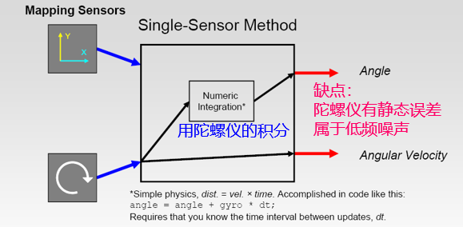
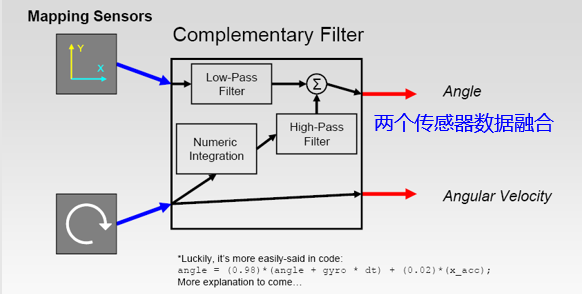
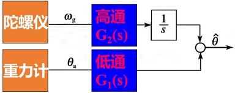

# 基于互补滤波的组合导航

* [返回上层目录](../navigation.md)
* [互补滤波的来源](#互补滤波的来源)
* [互补滤波的复频域表达式](#互补滤波的复频域表达式)
* [互补滤波总体流程](#互补滤波总体流程)

# 互补滤波的来源

已知有IMU（陀螺仪和加速度计），磁传感器，求欧拉角姿态。

分析：

（1）**加速度计**是低频准确，带有高频噪声。只能在飞行器稳定运行，即只能在物体除重力外不受其他力，即加速度计除了感受到重力加速度外没有其他加速度下使用，但是实际使用时有很大的高频噪声，如发动机或者电机的震动噪声。所以**直接用加速度计来计算姿态角是不可行的**。

如果对加计做低通滤波，然后计算角度，这样又会造成系统响应滞后。

（2）**陀螺仪**是高频准确，带有低频噪声。**通过积分角速度是可以得到角度**，但是积分结果只能短时间准确（数秒内），长时间积分会漂移。

那么如何利用加计和陀螺仪自身的特性，来得到姿态呢？

考虑到下面两点：

1、陀螺仪积分时间越久越不准确，短时间内很准确，所以误差是低频的；

2、加速度计对比重力方向短时间内很不准确，因为有其他加速度，但长时间平均后很准确，因为现实中的物体不可能总朝一个方向加速，所以误差是高频的。

1、滤除加速度计的高频噪声

2、滤除陀螺仪积分后的低频噪声

3、两个传感器数据权重相加为1.0

4、低频和高频滤波的截至频率要衔接

写成公式，即

其中，$C(s)$为一阶滤波器的截止频率，本来是固定的，这里写成了：

由于加了积分进去，本质上相当于**一阶滤波器的截止频率是动态自适应的**。

由于加了积分进去，本质上相当于**一阶滤波器的截止频率是动态自适应的**。

由于加了积分进去，本质上相当于**一阶滤波器的截止频率是动态自适应的**。

在继续推导下面的公式之前，需要简单回顾下低通滤波器公式中截止频率的含义。

下图是一个标准的一阶RC滤波器，但是设计成低通还是高通，由选取的输出变量来决定，若选取电阻两端的电压为输出，设计出来的是一阶高通滤波器；若选取电容两端的电压为输出，设计出来的是一阶低通滤波器，现在我们就以常见的一阶低通滤波器为例进行分析。

现在分析电路及传函。输入为电源电压 $V_s(t)$，输出为电容两端电压$V_c(t)$，那么列出电压方程：
$$
V_s(t)=RC\frac{dV_c(t)}{dt}+V_c(t)
$$
两端拉式变换：
$$
(RCs+1)V_c(s)=V_s(s)
$$
传递函数：
$$
G(s)=\frac{V_c(s)}{V_s(s)}=\frac{1}{RCs+1}
$$
这个形式是不是很熟悉，这就是典型的惯性环节啊。

那么由惯性环节的形式1
$$
G(s)=\frac{1}{\tau s+1}
$$
可以看出，时间常数$\tau=RC$。

由惯性环节的形式2
$$
G(s)=\frac{Y(s)}{X(s)}=\frac{w_c}{s+w_c}
$$
可以看出，其截止频率$w=\frac{1}{RC}$。

至此一阶滤波器推导完毕。继续看互补。

# 互补滤波的复频域表达式

把前面的内容稍微复制一点：

其中，$C(s)$为一阶滤波器的截止频率，本来是固定的，这里写成了：

所以，这里的C(s)就是截止频率。

现在推导复频域表达式：
$$
\begin{aligned}
&\hat{\theta}=\omega_g\times \frac{s}{s+C(s)}\times \frac{1}{s}+\theta_a\times\frac{C(s)}{s+C(s)}\\
\Rightarrow&(s+C(s))\hat{\theta}=\omega_g+\theta_aC(s)\\
\Rightarrow&s\hat{\theta}=\omega_g+(\theta_a-\hat{\theta})C(s)\\
\Rightarrow&s\hat{\theta}=\omega_g+(k_p+\frac{k_i}{s})\times(\theta_a-\hat{\theta})
\end{aligned}
$$
其中，复频域$s\hat{\theta}$表示时域的微分，复频域$k_i/s$代表时域的积分。

上式就是最终的互补滤波的公式。

# 互补滤波流程

## 互补滤波总体流程

（1）通过gyro获取角速度

（2）通过姿态矩阵微分方程，将体轴gyro的旋转向量不断添加到微分方程矩阵上，就可以实时更新姿态矩阵了

（3）通过姿态矩阵就可以获取姿态角A了

（4）将由姿态矩阵计算得出的姿态角A，与由加速度计和GPS或磁传感器得出的姿态角B相比作差，得到姿态角偏差

（5）将姿态角偏差进行PI运算，并用此结果对gyro值进行修正。

以上就是互补滤波的核心原理。

## 互补滤波详细流程

更具体的流程图如下：

### 从传感器获取正确姿态值

从传感器读取到加速度测量值并归一化为$\hat{a}_b=[a_x,a_y,a_z]^T$；磁力计测量值$\hat{m}_b=[m_x,m_y,m_z]^T$。

将加速度计测量值、磁力计测量值正则化为单位向量，作为期望值，这个值是符合实际的。

### 从姿态矩阵获取当前实际姿态值

（1）获取机体轴系中的重力向量

加速度计在静止时测量的是地球重力加速度$[0,0,1]^T$。有一点要注意，如果在运动时测量，需要减去离心加速度。

需要把归一化后的地轴系的重力向量，通过当前姿态矩阵转到体轴系下，因为要和加速度计传感器测量值进行比较，得到误差，来修正当前姿态。

此时体轴系下的重力向量$\hat{v}_b$其实包含了当前姿态矩阵$C_n^b$的信息，并不是绝对准确的，因为当前姿态$C_n^b$并不准确，需要校正。
$$
\begin{aligned}
\hat{v}_b=\begin{bmatrix}
v_x\\
v_y\\
v_z
\end{bmatrix}
&=
C_n^b
\begin{bmatrix}
0\\
0\\
1
\end{bmatrix}\\
\end{aligned}
$$
如果姿态矩阵$C_n^b$是基于四元数，则
$$
\begin{aligned}
\hat{v}_b
&=
\begin{bmatrix}
1-2(q_2^2+q_3^2)&2(q_1q_2+q_0q_3)&2(q_1q_3-q_0q_2)\\
2(q_1q_2-q_0q_3)&1-2(q_1^2+q_3^2)&2(q_2q_3+q_0q_1)\\
2(q_1q_3+q_0q_2)&2(q_2q_3-q_0q_1)&1-2(q_1^2+q_2^2)\\
\end{bmatrix}
\begin{bmatrix}
0\\
0\\
1
\end{bmatrix}\\
&=
\begin{bmatrix}
2(q_1q_3-q_0q_2)\\
2(q_2q_3+q_0q_1)\\
1-2(q_1^2+q_2^2)\\
\end{bmatrix}
\end{aligned}
$$
如果姿态矩阵$C_n^b$是基于DCM矩阵，则
$$
\begin{aligned}
\hat{v}_b
&=
\begin{bmatrix}
\cos\psi \cos\theta & \cos\theta \sin\psi & -\sin\theta\\
\cos\psi \sin\theta \sin\phi - \sin\psi \cos\phi & \sin\psi \sin\theta \sin\phi + \cos\psi \cos\phi & \cos\theta \sin\phi\\
\cos\psi \sin\theta \cos\phi + \sin\psi \sin\phi & \sin\psi \sin\theta \cos\phi - \cos\psi \sin\phi & \cos\theta \cos\phi\\
\end{bmatrix}
\begin{bmatrix}
0\\
0\\
1
\end{bmatrix}\\
&=
\begin{bmatrix}
-\sin\theta\\
\cos\theta \sin\phi\\
\cos\theta \cos\phi\\
\end{bmatrix}
\end{aligned}
$$
（2）获取机体轴系中的磁场向量

磁传感器测量的是地球的磁场的大小和方向，只不过这个方向不再是竖直向下，而是在北半球磁场线是向北且向下的，这里，其中，如果磁偏角为0，那么$b_y=0$。

类似加速度计在地轴系下的参考向量是$[0,0,1]^T$，那么磁传感器在地轴系下的参考向量是$[b_x,b_y,b_z]^T$，这里只考虑其北东二维水平向量，即只取$[b_x,b_y]^T$并归一化，如果磁偏角为0或者不考虑磁偏角，则$[b_x,b_y]^T=[1,0]^T$。

### 正确值与实际值做差并进行PI来修正当前姿态

此时，需要回顾一下前面的互补滤波复频域表达式：
$$
\begin{aligned}
&\hat{\theta}=\omega_g\times \frac{s}{s+C(s)}\times \frac{1}{s}+\theta_a\times\frac{C(s)}{s+C(s)}\\
\Rightarrow&(s+C(s))\hat{\theta}=\omega_g+\theta_aC(s)\\
\Rightarrow&s\hat{\theta}=\omega_g+(\theta_a-\hat{\theta})C(s)\\
\Rightarrow&s\hat{\theta}=\omega_g+(k_p+\frac{k_i}{s})\times(\theta_a-\hat{\theta})
\end{aligned}
$$
上式的$\theta_a$其实就是加速度计测量的重力向量为$\hat{a}_b=[a_x,a_y,a_z]^T$，上式的$\hat{\theta}$其实就是$\hat{v}_b$，

而上式的角度误差$\theta_a-\hat{\theta}$在小角度下可近似为向量叉乘，即$\hat{a}_b\times \hat{v}_b$。

### 加速度计差值

### 磁传感器差值

需要把磁传感器测量值从体轴系$m_b$转到地轴系下的$m_e$，然后取北东地的北东二维水平向量$[m_{ex},m_{ey}]$，然后和地磁场的参考向量$[b_x,b_y]^T=[1,0]^T$做叉乘进行比较得到误差$error_{bz}$，来修正当前姿态。

注意，这个误差是地轴系下的z向。为什么只取z向呢，因为xy向的地轴误差不需要磁传感器来纠正，用加速度计纠正就够了。

此时地轴系下的重力向量$m_e$其实包含了当前姿态矩阵$C_n^b$的信息，并不是绝对准确的，因为当前姿态$C_n^b$并不准确，需要校正。

然后把地轴系下的z向误差转到体轴系下，但是只取体轴系的z向误差$error_{bz}$，即
$$
\begin{aligned}
&C_n^b
\begin{bmatrix}
0\\
0\\
error_{nz}
\end{bmatrix}\\
=&\begin{bmatrix}
\cos\psi \cos\theta & \cos\theta \sin\psi & -\sin\theta\\
\cos\psi \sin\theta \sin\phi - \sin\psi \cos\phi & \sin\psi \sin\theta \sin\phi + \cos\psi \cos\phi & \cos\theta \sin\phi\\
\cos\psi \sin\theta \cos\phi + \sin\psi \sin\phi & \sin\psi \sin\theta \cos\phi - \cos\psi \sin\phi & \cos\theta \cos\phi\\
\end{bmatrix}
\begin{bmatrix}
0\\
0\\
error_{bz}
\end{bmatrix}\\
=&
\begin{bmatrix}
...\\
...\\
(\cos\theta \cos\phi)error_{nz}\\
\end{bmatrix}
=
\begin{bmatrix}
...\\
...\\
error_{bz}\\
\end{bmatrix}
\end{aligned}
$$

# 参考资料

* [The Balance Filter: A Simple Solution for Integrating Accelerometer and Gyroscope Measurements for a Balancing Platform ](https://d1.amobbs.com/bbs_upload782111/files_44/ourdev_665531S2JZG6.pdf)

本文开始的几张图片中的部分参考该pdf。

* [一阶低通滤波器公式的推导](https://zhuanlan.zhihu.com/p/161948566)

一阶低通滤波器的推导参考此知乎博客。

===

[Mahony航姿算法的参数调节方法](https://zhuanlan.zhihu.com/p/582694093)

