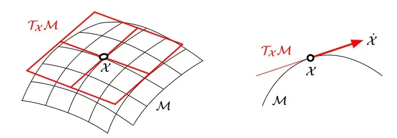
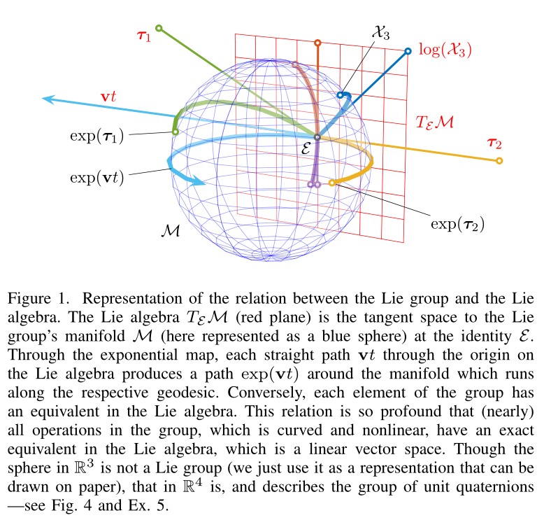
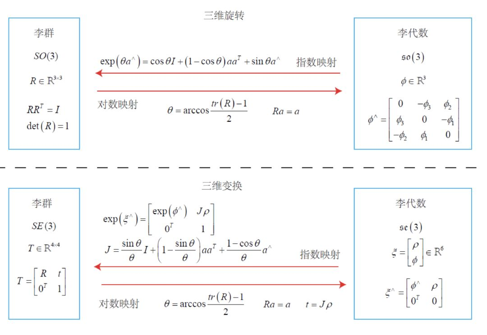

# 李群李代数

- [返回上层目录](../navigation.md)
- [前言](#前言)
- [基础](#基础)
- [群论](#群论)
- [李群](#李群)
- [矩阵指数](#矩阵指数)
  - [矩阵指数与旋转矩阵的关系](#矩阵指数与旋转矩阵的关系)
- [李代数](#李代数)
  - [李代数与李群的关系](#李代数与李群的关系)
  - [对数映射（log）和指数映射（exp）](#对数映射（log）和指数映射（exp）)
  - [李群李代数总结](#李群李代数总结)

一句话总结：

李群李代数的关系，其实结论差不多就是
$$
e^{\text{李代数}}=\text{李群}
$$
李代数，其实就是李群在恒等元处的切空间，这就是二者的联系。李代数即李群的局部线性化，用切面代替曲面，generally speaking，用切空间代替流形。

# 前言

研究位置与姿态，位置很好说，反正就是$xyz$，都是线性空间，中学就学过了。但是姿态就很难研究了，姿态的运算不满足加法律，导数也没法求，很多东西难以研究，所以就需要李群与李代数的理论指导了。说白一点，《李群与李代数》学的就是“**位姿微积分**”。

我们为什么要学“位姿微积分”，是因为我们在slam过程中要解决以下问题：

**什么样的相机位姿最符合当前观测数据，即解最优的R、t。**

# 基础

一般，我们认为三维旋转矩阵构成了特殊正交群SO(3)，而变换矩阵构成了特殊欧氏群（特殊欧几里得群）SE(3)。

形式如下：
$$
\begin{aligned}
SO(3)&=\left\{R\in \mathbb{R}^{3\times 3}|RR^T=I,det(R)=1\right\}\\
SE(3)&=\left\{
T=
\begin{pmatrix}
R & t\\
0^T & 1
\end{pmatrix}
\in \mathbb{R}^{4\times 4}
|
R\in SO(3),t\in \mathbb{R}^3
\right\}
\end{aligned}
$$
可以注意到，旋转矩阵也好，变换矩阵也好，它们对加法不封闭的。换句话说，对于任意两个旋转矩阵$R_1$，$R_2$，按照矩阵加法的定义，它们的和不再是一个旋转矩阵:
$$
\begin{aligned}
R_1+R_2&\notin SO(3)\\
T_1+T_2&\notin SE(3)
\end{aligned}
$$
可以说两种矩阵并没有良好定义的加法，或者通常矩阵加法对这两个集合不封闭。相对地，它们只有一种较好的运算：**乘法**。SO(3)和SE(3)关于乘法是封闭的:
$$
\begin{aligned}
R_1R_2&\in SO(3)\\
T_1T_2&\in SE(3)
\end{aligned}
$$
我们也可以对任何一个旋转或变换矩阵(在乘法的意义上)求逆。我们知道，乘法对应着旋转或变换的复合，两个旋转矩阵相乘表示做了两次旋转。

对于这种**只有一个(良好的)运算的集合**，我们称之为**群**。

# 群论

群是一种代数结构。通俗点说，**群就是元素集合加上代数运算**，使得集合中任意两个元素经过运算后形成的第三个元素仍然在这个集合里面。

设$G$是一个非空集合，$\cdot$是它的一个二元运算，如果满足以下条件：

(1) **封闭性**：若$a,b\in G$，则存在唯一确定的$c\in G$使得$a\cdot b=c$；

(2) **结合律**成立，即对$G$中任意元素$a,b,c$都有$(a\cdot b)\cdot c=a\cdot (b\cdot c)$；

(3) **单位元**存在：存在$e\in G$，对任意$a\in G$，满足$a\cdot e=e\cdot a=a$。$e$称为单位元，也称幺元；

(4) **逆元**存在：任意$a\in G$，存在$b\in G$，$a\cdot b=b\cdot a=e$（$e$为单位元），则称$a$与$b$互为逆元素，简称逆元。$b$记作$a^{−1}$；

则称**非空集合$G$对二元运算$\cdot$构成一个群**。

记作"封结幺逆"（凤姐咬你）。

通常称$G$上的二元运算$\cdot$为“乘法”，称$a\cdot b$为$a$与$b$的积，并简写为$ab$。

若群$G$中元素个数是有限的，则$G$称为有限群。否则称为无限群。有限群的元素个数称为有限群的阶。

易验证，旋转矩阵集合和矩阵乘法构成群，同样，变换矩阵和矩阵乘法也构成群(因此才称它们为旋转矩阵群)和变换矩阵群)。

其他常见的群包括：

整数的加法$(Z,+)$， 去掉0后的有理数的乘法（幺元为1）(Q\0, ⋅ )，等等。

矩阵中常见的群有:

- 一般线性群GL(n)：指$n\times n$的可逆矩阵，它们对矩阵乘法成群。
- 特殊正交群SO(n)：旋转矩阵群，其中SO(2)和SO(3)最为常见。
- 特殊欧氏群SE(n)：n维欧氏变换，如SE(2)和SE(3)。

# 李群

**李群**（Lie group）是**具有群结构的光滑微分流形**，是一种不可交换的连续群。

其群作用与微分结构相容。李群的名字源于挪威数学家Sophus Lie的姓氏，以其为连续变换群奠定基础。1893年，法文名词groupes de Lie首次出现在李的学生Arthur Tresse的论文第三页中。

SO(n)和SE(n)在实数空间上是连续的。我们能够直观地想象一个刚体能够连续地在空间中运动，所以它们都是李群。

因为光滑可微，所以每个李群元素处都有切空间。这个定义很清楚，但是似乎没那么直观，那么我们通过下图来了解到底什么是李群：

由上图可以看到，在我们的实空间（或者矩阵空间）中，有部分元素是群的元素，与通常的实空间内的连续不同，群空间在群运算作用下在不同的群元素之间“跳跃”。如果这些群元素刚好分布在一个微分流形上（即处处光滑的流形）时，就形成了李群。说的再通俗一点，原来我们习惯的空间是实空间或者向量空间这些，这些空间可以说是方方正正的，但是李群由于更多的约束条件，不再是方方正正的，而是在流形空间里边。

那么李群能有什么作用呢？首先，像定义里所说的可以对李群元素进行运算，会得到一个新的李群元素；其次，可以对欧式空间里的向量、矩阵进行操作，实现其位姿变换；最后是李群可以作为伴随算子对李代数进行变换，由局部切空间转换到指定李群元素处的切空间。

在这里主要讲的是两种常用的群：**特殊正交群**SO(n)和**特殊欧氏群**SE(3)。
$$
\begin{aligned}
SO(n)&=\left\{R\in \mathbb{R}^{n\times n}|RR^T=I,det(R)=1\right\}\\
SE(3)&=\left\{
T=
\begin{pmatrix}
R & t\\
0^T & 1
\end{pmatrix}
\in \mathbb{R}^{4\times 4}
|
R\in SO(3),t\in \mathbb{R}^3
\right\}
\end{aligned}
$$
对应的就是旋转矩阵与变换矩阵。

需要提一下特殊欧氏群的乘法运算：
$$
T_1T_2=
\begin{bmatrix}
R_1 & t_1\\
0^T & 1
\end{bmatrix}
\begin{bmatrix}
R_2 & t_2\\
0^T & 1
\end{bmatrix}
=
\begin{bmatrix}
R_1R_2 & R_1t_2+t_1\\
0^T & 1
\end{bmatrix}
\in SE(3)
$$
李群中有一类矩阵李群称为“三维特殊正交群（Special Orthogonal Group）”，其符号表示为 SO(3)，其实质是一系列满足两个条件的3阶方阵$R$构成的**群**，其中的元素构成一个可微流形。这两个条件分别是：
$$
\begin{aligned}
R^TR&=I\\
\det(R)&=1
\end{aligned}
$$
可以这样理解其命名：条件$R^TR=I$意味着这个群中的每个矩阵都是正交矩阵，这就是其“**正交**”性；条件$\det(R)=1$意味着这个群中的任一个正交矩阵的行列式均为正，而非负，而一般的正交矩阵的行列式是可正可负的，这就是其“**特殊**”性，其实这也意味着旋转矩阵遵循“右手坐标系”；又因为这个群中的矩阵均为3阶方阵，所以这个群称为“**三维特殊正交群**SO(3)”。

任意一个满足右手坐标系的旋转矩阵恰好都满足上面那两个条件，所以任意满足右手坐标系的三维旋转矩阵均属于群SO(3)。

# 矩阵指数

在说到SO(3)对应的李代数之前，需要先引入矩阵指数（Matrix Exponential）的概念：

矩阵指数可由线性微分方程的解的形式导出，例如有一个简单的标量一阶线性微分方程：
$$
\dot{x}(t)=ax(t)
$$
其中，$x(t)\in \mathbb{R}$，$a\in \mathbb{R}$，且初始条件为：$x(0)=x_0$，那么解为：
$$
x(t)=x_0e^{at}
$$
其中，**指数函数**可以展开为无穷级数的形式：
$$
e^{at}=1+at+\frac{(at)^2}{2!}+\frac{(at)^3}{3!}+...
$$
同理，对于**三维向量**对应的一阶线性微分方程：
$$
\dot{x}(t)=Ax(t)
$$
其中，$x(t)\in \mathbb{R}^3$，$A\in \mathbb{R}^{3\times 3}$，且初始条件为：$x(0)=x_0$，那么解为：
$$
x(t)=x_0e^{At}
$$
其中，**矩阵指数函数**可以展开为无穷级数的形式：
$$
e^{At}=1+At+\frac{(At)^2}{2!}+\frac{(At)^3}{3!}+...
$$

## 矩阵指数与旋转矩阵的关系

如上图所示的向量旋转，三维向量$p(0)$绕着单位旋转轴$\hat{\omega}$（$\hat{\omega} \in \mathbb{R}^3$, $||\hat{\omega}||=1$）旋转$\theta$角度，得到三维向量$p(\theta)$。该旋转运动亦可以视作是三维向量$p(0)$以$1 rad/s$的角速度绕着单位旋转轴$\hat{\omega}$从时间$t=0$运动到时间$t=\theta$得到三维向量$p(\theta)$。

如果用$p(t)$来表示旋转路径上向量端点处的位置，用$\dot{p}(t)$表示该点的瞬时速度值，则有：
$$
\dot{p}=\hat{w}\times p
$$
而向量叉乘可以写为左端向量对应的反对称矩阵与右端向量的乘积形式：
$$
\dot{p}=w^{\wedge}p
$$
其中，定义$\cdot^{\wedge}$为反对称矩阵算子，例如：
$$
\hat{w}=\begin{Bmatrix}
w_1\\
w_2\\
w_3
\end{Bmatrix}
$$
，那么有：
$$
w^{\wedge}=
\begin{bmatrix}
0 & -w_3 & w_2\\
w_3 & 0 & -w_1\\
-w_2 & -w_1 & 0
\end{bmatrix}
$$
那么上上式（$\dot{p}=w^{\wedge}p$）就有如下解：
$$
p(t)=p(0)e^{\hat{\omega}^{\wedge}t}
$$
因为角速度为1 rad/s，所以这里角度$\theta$和时间$t$是可以互换的：
$$
p(t)=p(0)e^{\hat{\omega}^{\wedge}\theta}
$$
由于反对称矩阵有满足$\left(\hat{w}^{\wedge}\right)^3=-\hat{w}^{\wedge}$，将矩阵指数函数展开有：
$$
\begin{aligned}
&e^{\hat{\omega}^{\wedge}\theta}\\
=&I+\hat{\omega}^{\wedge}\theta+\left(\hat{\omega}^{\wedge}\right)^2\frac{\theta^2}{2!}+\left(\hat{\omega}^{\wedge}\right)^3\frac{\theta^3}{3!}+...\\
=&I+\left(\theta-\frac{\theta^3}{3!}+\frac{\theta^5}{5!}-...\right)\hat{\omega}^{\wedge}+\left(\frac{\theta^2}{2!}-\frac{\theta^4}{4!}+\frac{\theta^6}{6!}-...\right)\left(\hat{\omega}^{\wedge}\right)^2\\
=&I+\sin\theta\hat{\omega}^{\wedge}+(1-\cos\theta)\left(\hat{\omega}^{\wedge}\right)^2
\end{aligned}
$$
因此，三维旋转矩阵$R$就可以用矩阵指数$e^{\hat{\omega}^{\wedge}\theta}$的形式来表示。

这其实就是罗德里格斯公式，很多人一直都不知道这个Rodrigues formula到底是干什么的，相信很多人在机器人，SLAM，甚至现在很火的元宇宙技术中经常会遇到这个东西。

**罗德里格斯公式本质上是李群与李代数的结合点。**本质上指数映射，算到最后，其实就是Rodrigues formula。

# 李代数

> 何为代数？代数又叫线性代数，本质就是定义了矢量乘法$V\times V\rightarrow V$的线性空间$V$。
>
> 李代数从名字来看也知道它是一个代数，即一个线性空间。
>
> 李代数的乘法被称为李括号。
>
> 这就是李代数, 可以看到, 它和李群可以一点儿关系也没有, 本质就是一个代数, 即线性空间.
>
> 为何要研究李代数？因为要研究李群。为何要研究李群？这就是你自己的问题了。我们知道李群是一坨具有群结构的流形，也就是说，是一块儿歪七扭八的几何体或空间。那搞起来肯定是很苦手的，所以我们就采取了物理人的终极奥义“展开一阶近似”来研究李群。
>
> 物理学中充斥着幂级数展开，这是因为实际上幂函数是九成物理人能处理的唯一函数。所谓一阶近似就是用切线代替曲线、用切面代替曲面，generally speaking，用切空间代替流形。
>
> 而李代数，其实就是李群在恒等元处的切空间，这就是二者的联系。
>
> 但李群那么大一坨，你只研究一个点，有啥用？
>
> 但其实这么做的巧妙之处就在这里, 我们可以从恒等元的切空间中以某种方式接到任意群元。具体而言就是李代数中的一个矢量可以生成一条李群上的参数曲线从而联系到每个群元。
>
> 更多参考请看：
>
> [如何通俗地解释李群和李代数的关系？](https://www.zhihu.com/question/356466246/answer/1736885298)
>
> [场论家用几何与代数（第一话）：李代数的崛起](https://zhuanlan.zhihu.com/p/344738859)

不论SO(3)还是SE(3)，都伴随着一个相应的李代数。

李代数的定义：

> 李代数是定义在某个数域$F$上的集合$V$，同时定义了一个称为李括号$[\cdot ,\cdot]$的二元运算符。我们把蓝色字体部分称为李代数的三个要素。同李群类似，对所有的$X,Y,Z\in V$和$a,b\in F$，李代数也必须满足四个性质：
>
> (1) 封闭性：$[X,Y]\in V$
>
> (2) 双线性：$[aX+bY,Z]=a[X,Z]+b[Y,Z]$和$[Z,aX+bY]=a[Z,X]+b[Z,Y]$
>
> (3)  自反性：$[X,X]=0$
>
> (4)  雅可比恒等：$[X,[Y,Z]]+[Y,[Z,X]]+[Z,[X,Y]]=0$
>
> 李括号表达了两个元素的差异。它不要求结合律，而要求元素和自己做李括号。
>
> 举例：三维向量$\mathbb{R}^3$上定义的叉积$\times$是一种李括号，因此$g=(R^3,R,\times)$构成了一种李代数。

可以将李代数理解为描述李群的“坐标”，用矩阵指数表示即
$$
e^{\text{李代数}}=\text{李群}
$$
你可以通过角动量的三个分量（李代数的基）生成空间转动群SO3（李群）; 反过来也可以 。

李群中没有加法，所以很多计算没法执行；所以有的人愿意把问题转到李代数里面计算。

**李代数就是数学家引入的一个方便对李群进行求导的表示方式。你可以理解为，李群是一个矩阵群，但是矩阵并不能在增加微小量之后方便的求导。于是就引入了李代数，解决了求导问题**。

通俗的就是李群的切空间是李代数（当然不是所有李代数都是这么来的）。李群作为一个流形，它在作为群的单位元点的切平面就是李代数。

你可以通过角动量的三个分量（李代数的基）生成空间转动群SO3（李群）; 反过来也可以。李群中没有加法，所以很多计算没法执行；所以有的人愿意把问题转到李代数里面计算。

前边提到了李群元素位于微分流形上，那么每一个李群元素处都可以有一个降一维的切空间，那么规定**幺元**处的切空间就是李代数，其他李群处的就是普通切空间。也可以理解**幺元**处形成了全局坐标系，而其他切空间处形成了局部坐标系，而伴随算子是对这些坐标系转换的工具。

注意，上面说的是在幺元处的切空间才是李代数，而不是在任意李群元素处的切空间是李代数。这块其实我也不怎么懂。李代数对应李群单位元处的切空间这一点只是两者的性质，与后文的指数/对数映射没有太大关系。（笔者一开始总是误会指数/对数映射只能在李群单位元处进行）。为什么呢？因为下面很快会知道：$\dot{R(t)}=\phi^{\wedge}R(t)$，所以当$R=I$时，上面的微分方程刚好是$\dot{R}=\phi^{\wedge}$，所以说反对称矩阵空间是旋转矩阵单位元处的切平面（导数）。

## 李代数与李群的关系

- 每个李群都对应一个李代数。SO(3)群的李代数是so(3)
- 为了不造成理解困难，这里只用SO(3)群作为讲解。（笔者发现，用SO(3)群作为例子，不看SE(3)群理解起来会更容易）
- 为什么要引入李代数？ 一句话说明：在SO(3)群上求导不太容易，因为旋转矩阵上的加法没有良好性质（两个旋转矩阵的加法不一定是一个旋转矩阵；回忆导数的定义，输入的微小变化造成的输出的改变量），而旋转矩阵的乘积在其中一者为微小量的时候，可以对应到李代数空间的线性关系。利用这一性质可以对旋转矩阵进行求导。旋转矩阵的更新也可以对应到李代数空间上的线性更新。
- **李代数对应李群单位元处的切空间**。旋转矩阵群的单位元就是单位矩阵。李代数对应李群单位元处的切空间这一点只是两者的性质，与后文的指数/对数映射没有太大关系。（笔者一开始总是误会指数/对数映射只能在李群单位元处进行）

## 对数映射（log）和指数映射（exp）

《视觉SLAM十四讲》中这部分内容（第四讲）是通过旋转矩阵求导引出的，但其实这部分的推导只是建立一个感性的理解。李群李代数的指数/对数映射应该具有更严格的定义。所以这部分内容其实不要太过纠结。

***再次强调***：这部分推导只是为了建立感性认识

由于旋转矩阵的性质：
$$
RR^T=I
$$
上式对旋转矩阵求导（$\dot{R}$表示$R$的导数）：
$$
\dot{R(t)}R(t)^T+R(t)\dot{R(t)}^T=0
$$
（这里对旋转矩阵求导，应该将其看作是一个变量，在时刻变化）

即：
$$
\dot{R(t)}R(t)^T=-R(t)\dot{R(t)}^T=-(\dot{R(t)}R(t)^T)^T
$$
也就是$\dot{R(t)}R(t)^T$是一个反对称矩阵，我们将其记为$\phi^{\wedge}$，则我们可以得到：
$$
\begin{aligned}
&\dot{R(t)}R(t)^T=\phi^{\wedge}\\
\Rightarrow&\dot{R(t)}=\phi^{\wedge}R(t)\\
\end{aligned}
$$
上式是关于$R$的一个微分方程，我们可以看出，当
$$
R=\exp(\phi^{\wedge}t)
$$
的时候，刚好满足上面的微分方程。同时，当$R=I$时，上面的微分方程刚好是$\dot{R}=\phi^{\wedge}$，所以说反对称矩阵空间是旋转矩阵单位元处的切平面（导数）。

于是，我们直接地引入定义：指数映射将李代数空间映射到李群空间，对数映射将李群映射到李代数空间。
$$
\begin{aligned}
\exp(\cdot)&:so(3)\rightarrow SO(3)\\
\log(\cdot)&:SO(3)\rightarrow so(3)
\end{aligned}
$$
为了更好的理解李群与李代数之间的关系，我们参考一个图：

**从图中我们可以看到从幺元处有李代数切空间，切空间中的向量通过“包覆”作用映射到李群空间中；而李群空间中的元素又可以通过对数映射从流形上”扒起来”回到切空间**。

用对数映射也能把大SO(3)李群空间中元素映射到小so(3)李代数空间中去。前面我们都是讲的SO(3)上的映射关系，放到SE(3)上推导类似，也是泰勒展开，旋转矩阵R映射结果和SO(3)一样，平移部分指数映射后会有稍许的不同，它前面多了一个系数矩阵，这些都可以自己证明一下

## 李群李代数总结

- 引入李代数的原因是在SLAM中常用的群：SO(3),SE(3),Sim(3)没有良好定义的加法，因此在优化的时候没法直接往上更新一个微小增量
- 另一个原因是SO(3),SE(3),Sim(3)这些群都有额外的限制，直接优化就变成了带约束的优化，而转到李代数空间则是一个无约束的优化问题
- 在后面我们可以看到当旋转矩阵乘以一个微小扰动可以对应到李代数空间的近似线性相加，这为优化带来很大的好处
- 李代数通过指数映射到李群，李群通过对数映射到李代数
- 李代数是李群单位元处的切平面
- 不要纠结上面的这句话！！！！对数映射/指数映射可以对整个李群/李代数空间进行映射！！！

# 参考资料

* [【视觉SLAM十四讲-个人笔记】李群与李代数](https://www.cnblogs.com/kidtic/p/14219387.html)

本文一开始参考了这篇文章。

* [李狗嗨：如何通俗地解释李群和李代数的关系？](https://www.zhihu.com/question/356466246/answer/931315125)

* [北京航空航天大学 机械设计及理论博士在读：如何通俗地解释李群和李代数的关系？](https://www.zhihu.com/question/356466246/answer/2612548870)

“矩阵指数与旋转矩阵的关系”参考此知乎回答。

* [北京航空航天大学 机械设计及理论博士在读：如何通俗地解释李群和李代数的关系？](https://www.zhihu.com/question/356466246/answer/2612548870)

* [为什么SLAM中很多使用四元数而不使用李代数？优势是什么？](https://www.zhihu.com/question/422718770/answer/3073161793)

"李代数"部分参考了。

* [SLAM中，李代数so(3)的指数映射就是这个旋转向量对应的旋转矩阵么？](https://www.zhihu.com/question/280293029/answer/3178969669)
* [【视觉SLAM十四讲-个人笔记】李群与李代数](https://www.cnblogs.com/kidtic/p/14219387.html)

这里有李代数se(3)的具体形式。